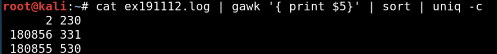
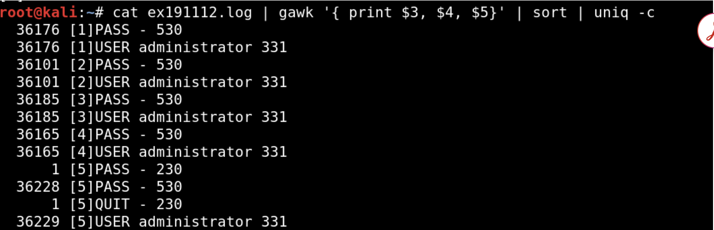
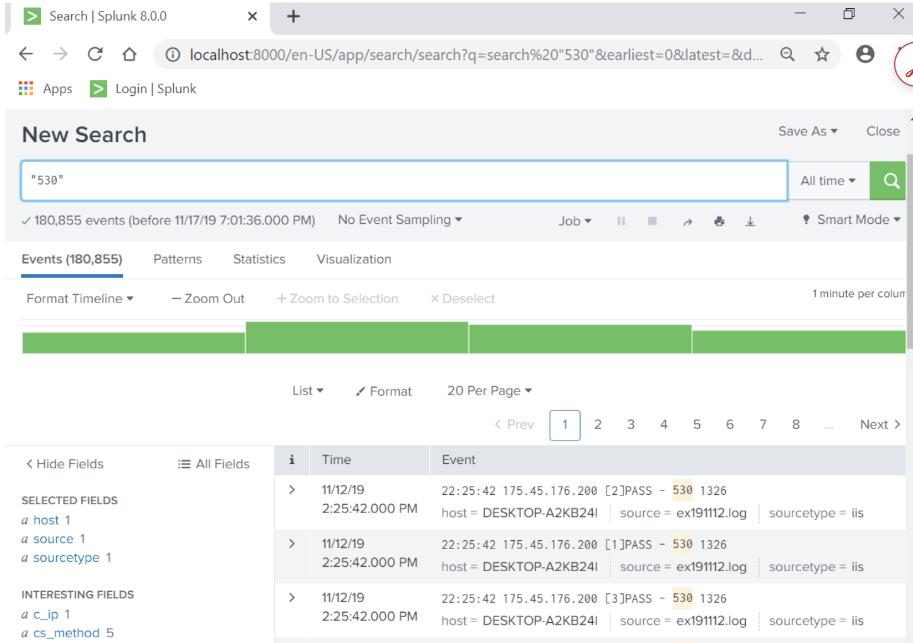
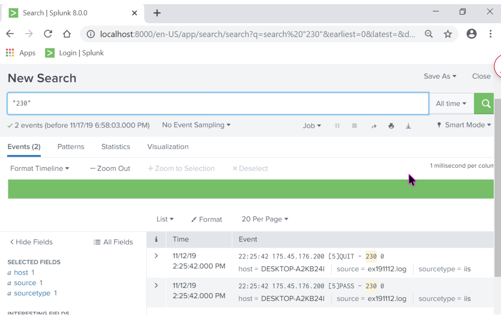

# SEC-455 Lab: FTP Brute-Force Log Analysis with Linux and Splunk

## Overview

This lab examined a large FTP log with Linux command-line utilities and Splunk. The objective was to extract useful security information from raw logs, validate findings across two analysis methods, and evaluate the operational trade-offs between lightweight command-line analysis and a centralized log-analysis platform.

The activity was completed in an authorized cyber-lab environment for SEC-455, Security Operations Center.

## Learning Objectives

- Inspect large log files with standard Linux commands.
- Filter events with `grep` and regular expressions.
- Extract and aggregate fields with `gawk`, `sort`, and `uniq`.
- Ingest and search log data in Splunk.
- Interpret FTP response codes and identify evidence of a brute-force attack.
- Compare command-line and graphical log-analysis workflows.

## Tools and Data

- Kali Linux
- Linux CLI utilities: `cat`, `wc`, `head`, `tail`, `grep`, `gawk`, `sort`, and `uniq`
- Splunk 8.0.0
- FTP log: `ex191112.log`
- Original log size: 361,717 lines

## Linux Command-Line Analysis

```bash
uname -a
ls
cat ex191112.log
wc -l ex191112.log
head ex191112.log
tail -n 10 ex191112.log
head -n 25 ex191112.log
tail -n 16 ex191112.log
grep 'Microsoft' ex191112.log
grep 'Date' ex191112.log
grep 'PASS - 230' ex191112.log
gawk '{print $1}' ex191112.log
gawk '{print $1}' ex191112.log | sort | uniq -c
gawk '{print $3,$4,$5}' ex191112.log | sort | uniq -c
gawk '{print $5}' ex191112.log | sort | uniq -c
```

The original file contained four non-event header lines. After those lines were removed as directed by the lab, 361,713 event records remained. The response-code counts also total 361,713, providing an internal check that the processed events were fully accounted for.

## Results

| FTP code or event | Meaning | Count |
| --- | --- | ---: |
| `331` | Login attempt requiring a password | 180,856 |
| `530` | Failed authentication | 180,855 |
| `230` events | Successful-login and quit records combined | 2 |
| `PASS - 230` | Successful login | 1 |
| `QUIT - 230` | Quit event after the successful login | 1 |



*Figure 1. Linux aggregation of the FTP response-code field.*



*Figure 2. Linux aggregation showing failed attempts, the successful login, and the quit event.*

## Splunk Validation

The same log was uploaded to Splunk using the IIS source type. The following searches validated the command-line findings:

```spl
"530"
```

The search returned 180,855 events, matching the Linux count for failed authentication.



*Figure 3. Splunk search returning 180,855 events containing code 530.*

```spl
"230"
```

The search returned two events: one `PASS - 230` event representing a successful login and one `QUIT - 230` event.



*Figure 4. Splunk search showing the successful login and subsequent quit event.*

## Security Finding

Analysis identified 180,856 login attempts against the administrator account. Of those attempts, 180,855 returned FTP code `530`, indicating authentication failure. One attempt eventually returned `PASS - 230`, confirming a successful login, followed by a `QUIT - 230` event.

The extremely high volume of repeated authentication attempts, followed by a successful login, is consistent with an automated brute-force attack that resulted in account compromise. The failure rate was approximately 99.9994%, but a single successful authentication was enough to defeat the account's protection.

## MITRE ATT&CK Mapping

| Tactic | Technique | Relevance |
| --- | --- | --- |
| Credential Access | [T1110: Brute Force](https://attack.mitre.org/techniques/T1110/) | Repeated authentication attempts preceded a successful administrator login. |
| Initial Access | [T1078: Valid Accounts](https://attack.mitre.org/techniques/T1078/) | A successful authentication may enable access through a compromised legitimate account. |

## Linux CLI and Splunk Comparison

| Area | Linux command line | Splunk |
| --- | --- | --- |
| Setup | Works directly with the local file | Requires data ingestion and source configuration |
| Speed in this lab | Produced results immediately | Required indexing before searching |
| Interface | Text-based | Graphical and searchable |
| Analyst knowledge | Requires command and syntax familiarity | Easier for analysts unfamiliar with shell commands |
| Automation | Strong scripting and pipeline support | Supports saved searches, alerts, reports, and dashboards |
| Scale | Effective for focused local analysis | Better suited to centralized, multi-source monitoring |
| Cost or limits | Standard utilities are free | Lab free edition was limited to 500 MB of ingestion per day |

Both approaches produced the same forensic counts. Linux provided speed and flexibility for a single local file, while Splunk provided accessible searching, centralized visibility, and capabilities better suited to ongoing SOC monitoring.

## Defensive Recommendations

- Enforce long, unique passwords and multi-factor authentication where supported.
- Apply account lockout, rate limiting, or throttling controls appropriate to the service.
- Disable or restrict FTP where a more secure managed file-transfer solution is available.
- Monitor repeated authentication failures and alert on a successful login following a failure burst.
- Centralize authentication logs and retain them long enough to support investigations.

## Evidence

Add sanitized screenshots to the `evidence/` directory using these exact filenames:

- `linux-ftp-code-counts.png`
- `linux-session-breakdown.png`
- `splunk-530-failed-logins.png`
- `splunk-230-events.png`

Do not upload the raw FTP log unless course rules and data-handling requirements explicitly permit publication. Redact credentials, tokens, personal data, internal hostnames, IP addresses, and other sensitive information from all artifacts.

## Conclusion

The lab confirmed that the 361,717-line FTP log captured an automated brute-force attack. Linux analysis identified 180,856 login attempts, 180,855 authentication failures, one successful login, and a subsequent quit event. Splunk returned the same event counts, validating the command-line results.

The primary learning outcome was understanding how to investigate the same network incident through two different workflows. Linux utilities provided fast and lightweight analysis but depended on accurate command syntax. Splunk offered centralized searching and a visual interface but required ingestion and configuration. Together, these tools demonstrate how SOC analysts can select an analysis method based on the size of the investigation, available infrastructure, and operational requirements.

## Authorized Use

This material documents an authorized educational lab. It is intended for defensive-security learning only.
